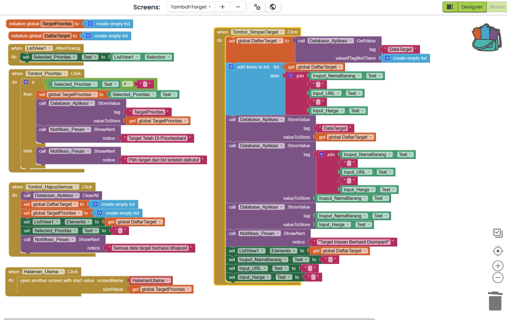
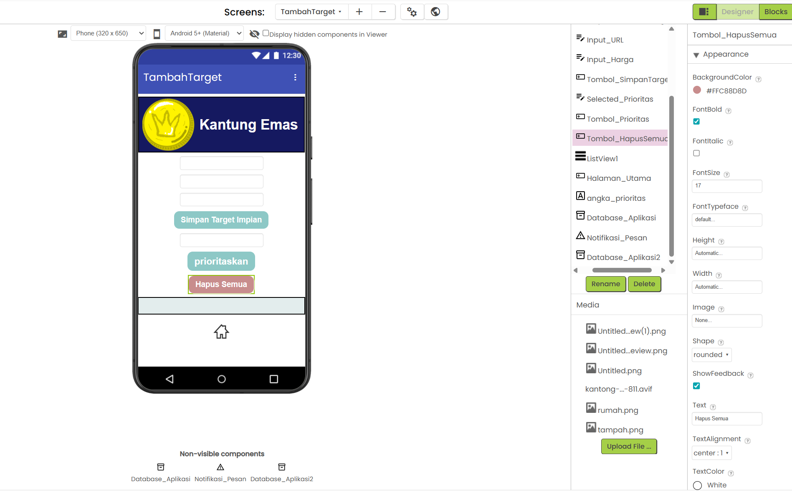
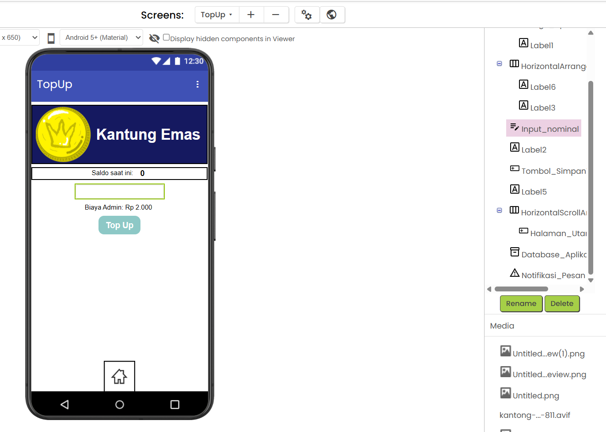
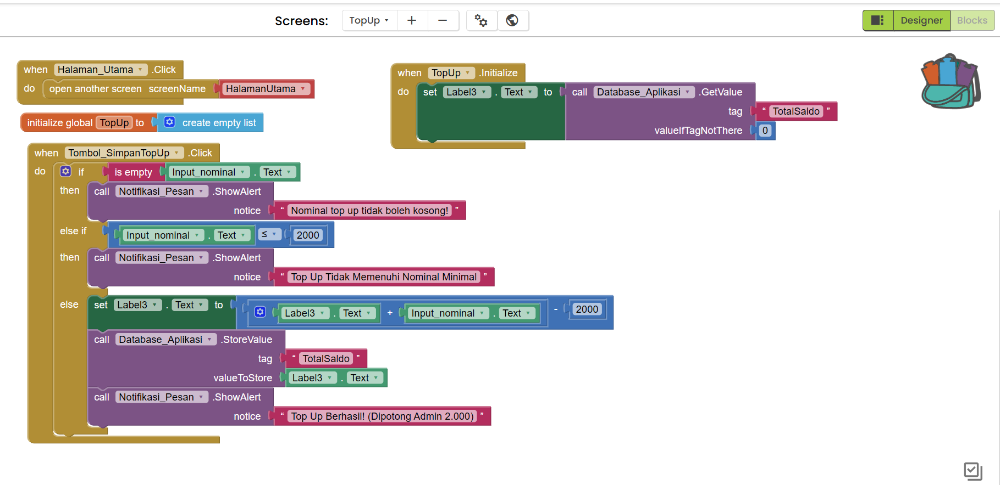

# **Panduan Arsyad - Codingfest**

Ikuti langkah-langkah di bawah ini secara berurutan pada halaman **Blocks** di MIT App Inventor.

---

### Bagian 1: Memperbaiki Fitur Klik List View (Agar tampil di Selected_Prioritas)

Saat ini, aplikasi menggunakan `SelectionDetailText`. Karena kamu menyimpan data dalam bentuk satu baris teks gabungan (Nama + URL + Harga), kita harus menggunakan `Selection`.

1. Cari blok coklat yang bernama `when ListView1 .AfterPicking`.
2. Di dalam blok hijau tua `set Selected_Prioritas .Text to`, kamu akan melihat blok hijau muda `ListView1 .SelectionDetailText`.
3. Klik dan **tarik/hapus** (masukkan ke tong sampah) blok hijau muda `ListView1 .SelectionDetailText` tersebut.
4. Pergi ke panel kiri, klik kategori komponen **ListView1** (warna hijau tua).
5. Scroll ke bawah, cari dan ambil blok hijau muda `ListView1 .Selection`.
6. Tempelkan/masukkan blok `ListView1 .Selection` tersebut ke dalam lubang kosong pada blok `set Selected_Prioritas .Text to`.

_(Sekarang, saat list diklik, teks yang dipilih akan langsung muncul di kotak Selected_Prioritas secara real-time)._

---

### Bagian 2: Memperbaiki Tombol Prioritas (Agar menyimpan data dengan benar)

Blok `when prioritas .Click` kamu saat ini memiliki logika perbandingan yang kurang tepat dan menyimpan variabel `global TargetPrioritas` yang isinya masih kosong (empty list). Mari kita rombak ulang.

1. **Hapus blok lama**: Pisahkan dan buang seluruh isi yang ada di dalam blok coklat `when prioritas .Click` ke tong sampah, sehingga blok tersebut menjadi kosong.
2. Buka kategori **Control** (warna oranye kekuningan di pojok kiri atas).
3. Ambil blok `if ... then ... else` (bukan yang if then biasa ya, tapi yang ada else-nya). Pasang ke dalam blok `when prioritas .Click`.
4. **Mengisi lubang `if` (Pengecekan apakah ada teks yang dipilih)**:
   - Buka kategori **Logic** (warna hijau muda), ambil blok perbandingan `[ ] = [ ]`. Tempelkan di sebelah tulisan `if`.
   - Klik tanda `=` pada blok tersebut, dan ubah menjadi `≠` (tidak sama dengan).
   - Di lubang kiri blok `≠`: Buka komponen **Selected_Prioritas** (warna hijau tua), ambil blok hijau muda `Selected_Prioritas .Text`. Tempelkan.
   - Di lubang kanan blok `≠`: Buka kategori **Text** (warna merah muda), ambil blok teks kosong `" "`. Tempelkan. Biarkan teks di dalamnya kosong.
     _(Logika ini berarti: "Jika teks Selected_Prioritas tidak kosong, maka laksanakan...")_
5. **Mengisi area `then` (Proses jika target sudah dipilih)**:
   - Buka kategori **Variables** (warna oranye), ambil blok `set [ ] to`. Pilih `global TargetPrioritas` dari dropdown. Tempelkan di dalam `then`.
   - Buka komponen **Selected_Prioritas**, ambil blok hijau muda `Selected_Prioritas .Text`. Tempelkan di lubang blok `set` tadi. _(Ini akan menangkap Nama, URL, dan Harga sekaligus)._
   - Buka komponen **Database_Aplikasi** (warna ungu), ambil blok `call Database_Aplikasi .StoreValue`. Tempelkan di bawah blok `set` (masih di dalam area `then`).
   - Di lubang `tag`: Buka kategori **Text** (merah muda), ambil teks kosong `" "`, ketikkan `"TargetPrioritas"`.
   - Di lubang `valueToStore`: Buka kategori **Variables**, ambil blok `get [ ]`, pilih `global TargetPrioritas`. Tempelkan.
   - Buka komponen **Notifikasi_Pesan** (warna ungu), ambil blok `call Notifikasi_Pesan .ShowAlert`. Tempelkan di bawah blok StoreValue.
   - Di lubang `notice`: Ambil blok teks kosong `" "` dari kategori **Text**, ketikkan `"Target Telah Di Prioritaskan!"`.
6. **Mengisi area `else` (Peringatan jika user belum memilih target tapi sudah klik tombol)**:
   - Buka komponen **Notifikasi_Pesan**, ambil blok `call Notifikasi_Pesan .ShowAlert`. Tempelkan di dalam celah `else`.
   - Di lubang `notice`: Ambil blok teks kosong `" "` dari kategori **Text**, ketikkan `"Pilih target dari list terlebih dahulu!"`.

---

### Bagian 3: Membuat Fitur Hapus Semua Data

**A. Persiapan di Halaman Designer**

1. Pastikan kamu berada di mode **Designer** (tombol di pojok kanan atas).
2. Dari panel **User Interface** (sebelah kiri), tarik komponen **Button** ke dalam layar HP (misalnya letakkan di bawah tombol prioritaskan).
3. Di panel **Properties** (sebelah kanan), ubah **Text** menjadi `Hapus Semua Target`.
4. Di panel **Components** (tengah), klik tombol tersebut lalu klik **Rename**. Ubah namanya menjadi `Tombol_HapusSemua`.

---

**B. Merangkai Logika di Halaman Blocks**

1. Beralih kembali ke mode **Blocks**.
2. **Membuat event klik**: Buka komponen **Tombol_HapusSemua** (warna hijau tua) di panel kiri, ambil blok `when Tombol_HapusSemua .Click` dan letakkan di area kosong.
3. **Menghapus data di Database**: Buka komponen **Database_Aplikasi** (warna ungu), ambil blok `call Database_Aplikasi .ClearAll`. Tempelkan di dalam blok `when Tombol_HapusSemua .Click`. _(Ini akan menghapus seluruh data yang tersimpan di memori HP untuk aplikasi ini)._
4. **Mengosongkan variabel Daftar Target**:
   - Buka kategori **Variables** (oranye), ambil blok `set [ ] to` dan pilih `global DaftarTarget`. Tempelkan di bawah blok `ClearAll`.
   - Buka kategori **Lists** (biru muda), ambil blok `create empty list`. Tempelkan di lubang blok `set` tadi.
5. **Mengosongkan variabel Target Prioritas**:
   - Buka kategori **Variables**, ambil blok `set [ ] to` lagi dan pilih `global TargetPrioritas`. Tempelkan di bawahnya.
   - Buka kategori **Lists**, ambil blok `create empty list`. Tempelkan di lubangnya.
6. **Memperbarui tampilan List View agar kosong**:
   - Buka komponen **ListView1** (hijau tua), ambil blok `set ListView1 .Elements to`. Tempelkan di baris berikutnya.
   - Buka kategori **Variables**, ambil blok `get [ ]`, pilih `global DaftarTarget`. Tempelkan di lubang blok `ListView1`.
7. **Mengosongkan teks di kotak Selected Prioritas**:
   - Buka komponen **Selected_Prioritas** (hijau tua), ambil blok `set Selected_Prioritas .Text to`. Tempelkan di bawahnya.
   - Buka kategori **Text** (merah muda), ambil blok teks kosong `" "`, pastikan tidak ada spasi di dalamnya. Tempelkan.
8. **Memunculkan notifikasi sukses**:
   - Buka komponen **Notifikasi_Pesan** (ungu), ambil blok `call Notifikasi_Pesan .ShowAlert`. Tempelkan di paling bawah (masih di dalam blok Click).
   - Di lubang `notice`: Buka kategori **Text**, ambil blok teks kosong `" "`, dan ketikkan `"Semua data target berhasil dihapus!"`.

# **Hasil Blocksnya akan seperti berikut**

# **Hasil Desainnya akan seperti berikut**

---

### Bagian 4: Memperbaiki Logika Penyimpanan Saldo (Halaman TopUp)

Kita akan merombak blok `when Tombol_SimpanTopUp .Click` agar menyimpan ke Tag yang benar, dan menambahkan blok Initialize agar saldo lama tidak hangus.

**A. Menampilkan Saldo Saat Halaman Dibuka**
Agar saat masuk ke halaman TopUp saldo terakhir kita langsung muncul di layar (tidak mulai dari 0).

1. Buka komponen **TopUp** (halaman paling atas di panel kiri), ambil blok coklat `when TopUp .Initialize`.
2. Buka komponen **Label3** (hijau tua), ambil blok `set Label3 .Text to` dan tempelkan di dalam `Initialize`.
3. Buka komponen **Database_Aplikasi** (ungu), ambil blok `call Database_Aplikasi .GetValue`. Tempelkan di lubangnya.
4. Di lubang `tag`: Ambil teks kosong `" "` dari kategori **Text**, ketikkan `"TotalSaldo"`. _(Perhatikan huruf besar-kecilnya, harus sama persis dengan yang di Halaman Utama)._
5. Di lubang `valueIfTagNotThere`: Buka kategori **Math** (biru tua), ambil blok angka, ketikkan `0`.

---

**B. Merombak Ulang Proses Simpan (Isi dari `else`)**
Karena isi dari bagian `else` kamu saat ini terlalu rumit dan ada penempatan `join` yang salah, mari kita kosongkan isi `else` tersebut ke tong sampah, lalu susun ulang dari awal.

1. **Update Label di Layar Dulu:**
   - Buka komponen **Label3**, ambil blok `set Label3 .Text to`. Tempelkan paling atas di dalam area `else`.
   - Buka kategori **Math**, ambil blok pengurangan `[ ] - [ ]`. Tempelkan di lubang set Label3.
   - Di lubang kiri pengurangan: Buka kategori **Math**, ambil blok penjumlahan `[ ] + [ ]`. Tempelkan di situ.
   - Di lubang kiri penjumlahan: Ambil `Label3 .Text`.
   - Di lubang kanan penjumlahan: Ambil `Input_nominal .Text`.
   - Di lubang kanan pengurangan: Ambil blok angka dari **Math**, ketikkan `2000`.
     _(Logika ini akan langsung mengubah teks di layar menjadi: Saldo Lama + Nominal Top Up - 2000)._

2. **Simpan ke Database (Total Saldo):**
   - Buka komponen **Database_Aplikasi** (ungu), ambil blok `call Database_Aplikasi .StoreValue`. Tempelkan di bawah blok set Label3 tadi.
   - Di lubang `tag`: Ambil teks `" "` dari **Text**, ketikkan `"TotalSaldo"`.
   - Di lubang `valueToStore`: Ambil `Label3 .Text` (karena Label3 sudah berisi total saldo yang baru dihitung di langkah 1).

3. **Munculkan Notifikasi:**
   - Buka komponen **Notifikasi_Pesan**, ambil `call Notifikasi_Pesan .ShowAlert`. Tempelkan di bawah blok StoreValue.
   - Isi notice dengan `"Top Up Berhasil! (Dipotong Admin 2.000)"`.

_(Catatan: Saya merekomendasikan untuk **menghapus** blok yang berkaitan dengan `global TopUp` dan tag `"DataTopUp"` dari kodemu jika kamu belum membuat fitur riwayat/history transaksi. Blok tersebut saat ini hanya memberatkan memori tanpa fungsi)._

---

### Bagian 6: Memperbaiki Error Saat Input Nominal Top Up Kosong

Kita akan memodifikasi blok `if` yang sudah ada agar memiliki 3 kondisi cabang (kosong, kurang dari 2000, dan berhasil).

**Langkah Perbaikan di Halaman Blocks:**

1. Fokus pada blok coklat `when Tombol_SimpanTopUp .Click`. Di dalamnya ada blok `if...then...else` berwarna biru muda.
2. **Memodifikasi bentuk blok if**:
   - Klik ikon **roda gigi (gear) berwarna biru** di pojok kiri atas blok `if` tersebut.
   - Akan muncul sebuah kotak kecil. Tarik blok `else if` dari sisi kiri kotak kecil tersebut, dan pasangkan di bawah blok `if` pada sisi kanannya. (Sehingga susunannya menjadi `if`, `else if`, `else`).
   - Klik kembali ikon roda gigi biru untuk menutup kotaknya.
3. **Memindahkan kondisi lama ke bawah**:
   - Tarik/pindahkan blok perbandingan warna biru muda (`Input_nominal .Text <= 2000`) dari lubang `if` yang paling atas, turunkan ke lubang `else if` yang baru saja kita buat di tengah.
   - Pindahkan juga blok `call Notifikasi_Pesan` yang berisi `"Top Up Tidak Memenuhi Nominal Minimal"` ke celah `then` tepat di bawah `else if` tersebut.
4. **Membuat kondisi baru untuk input kosong**:
   - Sekarang lubang `if` paling atas menjadi kosong. Buka kategori **Text** (warna merah muda).
   - Ambil blok `is empty` dan tempelkan di sebelah tulisan `if` paling atas.
   - Buka komponen **Input_nominal** (warna hijau tua), ambil blok `Input_nominal .Text`. Tempelkan ke dalam lubang blok `is empty` tadi.
     _(Logika ini berarti: Jika teks Input_nominal kosong, maka...)_
5. **Menambahkan peringatan kosong**:
   - Buka komponen **Notifikasi_Pesan** (warna ungu), ambil blok `call Notifikasi_Pesan .ShowAlert`. Tempelkan di dalam celah `then` yang paling atas.
   - Di lubang `notice`: Buka kategori **Text**, ambil blok teks kosong `" "`, dan ketikkan `"Nominal top up tidak boleh kosong!"`.
6. **Selesai!** Biarkan bagian `else` yang paling bawah beserta isinya (logika perhitungan saldo dan `StoreValue`) persis seperti apa adanya, tidak perlu diubah karena sudah benar.

---

# **Hasil Desain Halaman TopUp akan seperti berikut**

# **Hasil Blocks Halaman TopUp akan seperti berikut**

### Bagian 4: Menampilkan Target, Saldo, dan Persentase Progres di Halaman Utama

Kita akan mengatur agar saat Halaman Utama dibuka, aplikasi langsung menarik data dari database dan melakukan perhitungan matematika agar visual _progress bar_ menampilkan persentase penyelesaian yang akurat.

**A. Membuat Variabel Penampung**
Pertama, kita siapkan variabel untuk menyimpan angka agar mudah dihitung. Kita gunakan penamaan bahasa Indonesia agar alur logikanya lebih mudah dibaca.

1. Buka kategori **Variables** (warna oranye), ambil blok `initialize global name to`.
2. Ubah teks `name` menjadi `SaldoSaatIni`.
3. Buka kategori **Math** (warna biru tua), ambil blok angka `0` dan tempelkan.
4. Ulangi langkah 1-3 untuk membuat satu variabel lagi dan beri nama `HargaTarget`.

---

**B. Menampilkan Target Prioritas**
Sekarang kita perbarui isi Halaman Utama. (Merujuk pada gambar `image_9f409f.png`, buang isi blok hijau tua `set Label1 .Text to` yang lama dari dalam `when HalamanUtama .Initialize`).

1. Buka komponen **HalamanUtama** di panel kiri, ambil blok coklat `when HalamanUtama .Initialize`.
2. Buka komponen **target_prioritas** (warna hijau tua), ambil blok `set target_prioritas .Text to`. Tempelkan di dalam blok `Initialize`.
3. Buka komponen **TinyDB1** (warna ungu), ambil blok `call TinyDB1 .GetValue`. Tempelkan ke lubang `set target_prioritas` tadi.
4. Di lubang `tag`: Buka kategori **Text** (merah muda), ambil teks kosong `" "`, ketikkan `"TargetPrioritas"`.
5. Di lubang `valueIfTagNotThere`: Beri teks kosong dan ketikkan `"-"`.

---

**C. Menampilkan Nominal Saldo**
_(Catatan: Pastikan pada halaman TopUp, kamu menyimpan hasil akhir penambahan saldo ke TinyDB dengan tag yang jelas, misalnya `"TotalSaldo"`)_.

1. Buka komponen **Label1** (atau komponen label yang kamu siapkan untuk angka saldo), ambil blok `set Label1 .Text to`. Tempelkan di bawah blok target tadi (masih di dalam `Initialize`).
2. Buka komponen **TinyDB1**, ambil blok `call TinyDB1 .GetValue`. Tempelkan.
3. Di lubang `tag`: Ketikkan `"TotalSaldo"`.
4. Di lubang `valueIfTagNotThere`: Buka kategori **Math**, masukkan angka `0`.
5. **Simpan ke variabel**: Buka kategori **Variables**, ambil blok `set [ ] to`, pilih `global SaldoSaatIni`. Tempelkan di bawah blok `Label1` tadi.
6. Isi lubangnya dengan mengambil blok `Label1 .Text` (dari komponen **Label1**).

---

**D. Mengatur Linear Progress Berdasarkan Persentase**
Agar visual _progress bar_ berjalan secara akurat berdasarkan persentase penyelesaian, kita harus menghitung perbandingan antara saldo saat ini dengan harga target.

1. Buka komponen **LinearProgress1** (hijau tua), ambil blok `set LinearProgress1 .Progress to` (atau atribut penentu nilainya, tergantung jenis ekstensi progres yang kamu gunakan). Tempelkan di baris paling bawah dalam blok `Initialize`.
2. Buka kategori **Math** (biru tua), ambil blok perkalian `[ ] * [ ]`. Tempelkan ke lubang blok progres tadi.
3. Di lubang sebelah **kiri perkalian**:
   - Buka kategori **Math**, ambil blok pembagian `[ ] / [ ]`. Tempelkan di lubang kiri tersebut.
   - Di lubang kiri pembagian: Buka **Variables**, ambil `get global SaldoSaatIni`.
   - Di lubang kanan pembagian: Buka **Variables**, ambil `get global HargaTarget`. _(Pastikan variabel HargaTarget ini sudah kamu isi dengan angka harga dari target prioritasmu)_.
4. Di lubang sebelah **kanan perkalian**:
   - Buka kategori **Math**, ambil blok angka, dan ketikkan `100`.

**Formula akhirnya akan berbentuk:**
`set LinearProgress1 .Progress to` -> `(get global SaldoSaatIni / get global HargaTarget) * 100`
